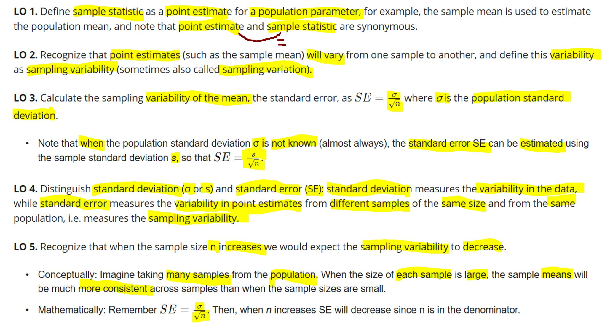
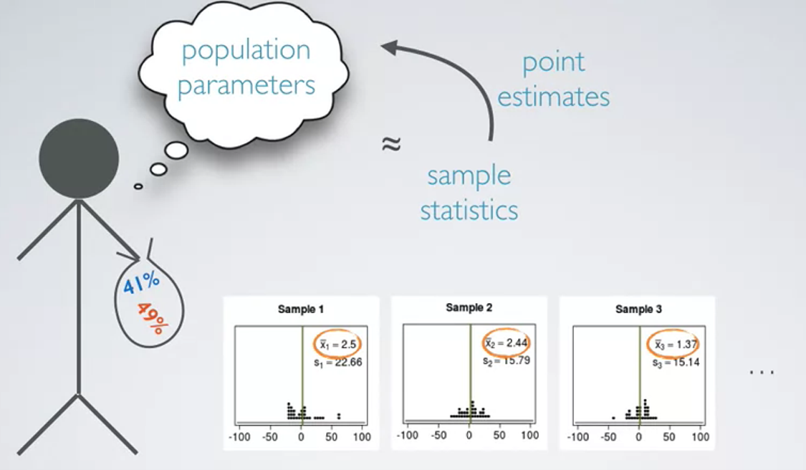
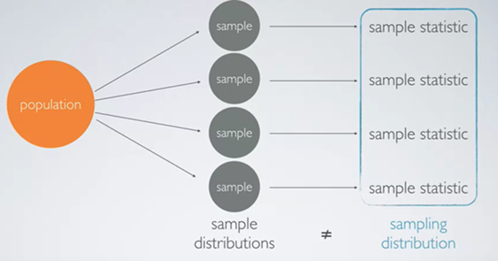
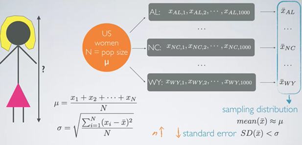
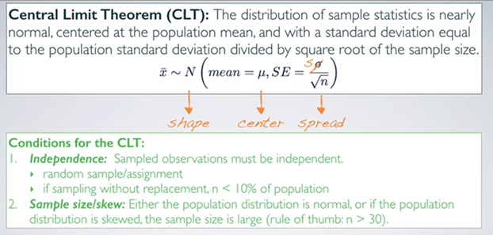
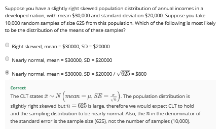
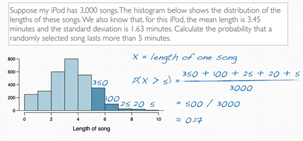
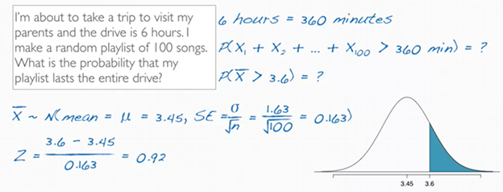
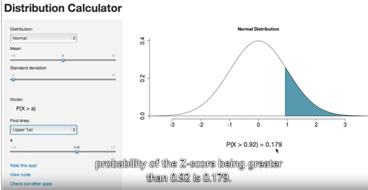
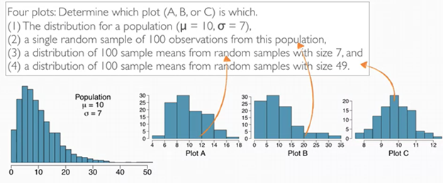

# Central Limit Theorem(CLT) and Sampling {#clt}

## Chapter Summary

```{r chap1-summary-fig, echo=FALSE, fig.align='center', fig.asp=.75, fig.cap='Chapter Summary', out.width='80%'}

```
由于通常不太可能直接获得population parameter（如全国所有人身高的平均值）因此通常使用sample statistics/point estimates来约等于或者估算population parameter

在这个例子中，也可以观察到在计算sample statistics时，每一组sample的平均值都不太一样，之后要计算这些平均值的standard deviation

```{r fig1, echo=FALSE, fig.align='center', fig.asp=.75, fig.cap='Introduction', out.width='80%'}

```

## Sampling Distribution 与 Sampling Distribution

Sample distribution 和sampling distribution看上去相似但不是同一个意思；

Sample distribution:

- Sample distribution是The distributions of the observations with in each sample
- sample distribution的observation是individual（比如说people/case）

Sampling distribution:

- Sampling distribution是the distribution of the sample statistics
- sampling distribution的observation是sampled statistics


```{r fig3, echo=FALSE, fig.align='center', fig.asp=.75, fig.cap='Sampling vs. sample distribution', out.width='80%'}

```

## Standard Error

这里在计算全美的平均身高时:

- μ代表population mean
- σ代表population standard deviation

但其实每个state的standard deviation会比population的SD要低的（因为人口基数的不同有的state可能人都高，SD小，但整体全国就会包含个子高的state和个子矮的state，因此SD一定会更高一些-?）

Standard error： the standard deviation of sample mean

- N（这里的N表示sample size）越大，Standard error越小

```{r fig4, echo=FALSE, fig.align='center', fig.asp=.75, fig.cap='Standard error', out.width='80%'}

```


## Central Limit Theorem(CLT) 

**定义**

sample statistics（如每个sample的mean）的分布应该是正态分布，以population mean作为中心，并以population SD/根号下sample size作为SE


正常来说应该用population 的SD除根号下sample size，但通常不太能获取population SD，所以也一般用sample SD来估计population SD，但这里的sample SD指的是每次取得的单个sample而不是所有sample之和

**条件**

1.	所有的sample选取要保证互相独立

- 可以是random sample/assignment
- 如果是无replacement 的取样，应该保证sample size N要小于10%的population（也就是说这种情况下 sample size要小一点会好一些，保证sample之间可以相互独立，size太大的话容易收集到具有相似属性的人，如兄弟姐妹家庭等，导致不够independent）


2.	要保证原本整体的population要不然是正态分布，要不然population是skewed并且sample size是足够大的（即sample size大于30）

- 如果population 不是normal distribution，那么population 越skewed，需要的sample size就要越大
- 如果population是highly right skewed, 选取的sample size又很少，那么sample mean的distribution也会是right skewed，只有sample size大到一定程度，才能变成normalization


```{r fig5, echo=FALSE, fig.align='center', fig.asp=.75, fig.cap='Standard error', out.width='80%'}

```


**Exercise**

- 用于直接visualize各种distribution的[website](https://gallery.shinyapps.io/CLT_mean/)
- 例题1：

```{r fig6, echo=FALSE, fig.align='center', fig.asp=.75, fig.cap='Ex 1', out.width='80%'}

```

- 例题2：


```{r fig7, echo=FALSE, fig.align='center', fig.asp=.75, fig.cap='Ex 2', out.width='80%'}

```

这里并不能直接用Z-score 来计算length大于5的歌曲的概率，因为只有在population distribution为normal distribution的时候才可以这么计算。

这里的分布是right skewed，因此可以利用histogram 来粗略估计，从而得到0.17的概率。


- 例题3：

```{r fig8, echo=FALSE, fig.align='center', fig.asp=.75, fig.cap='Ex 2', out.width='80%'}



```


在这个情况下，要计算probability的时候，我们不是要求每首歌都长于3.6min，而是要求这100首歌的总时长大于360mins，即sample mean of those 100 songs > 3.6. 


基于CLT，可以知道这些歌的sample mean会是normal分布，
因此可以计算z-score。

- 这里计算Z的时候要除以standard deviation of sample mean(即SE, 0.163), 而不是population SD(1.63)，因为这里讨论的对象并不是单首歌的时长，而是平均每首歌的sample mean, 因此要用SE。
- 最后用table或者各种方法，找到对应z-score为0.92的probability，即0.179

> Both in a population and in one, one sample, the observations are still individual observations, so not sample means. (?)

即如果将一个sample组中的所有数据拿出来，这样还是会体现出原本population的分布情况，而不是sample mean的分布情况。

- 例题4：

```{r fig10, echo=FALSE, fig.align='center', fig.asp=.75, fig.cap='Ex 3', out.width='80%'}

```

- 这里可以先选出选项4对应plot C，因为选项4可以判断，由于本身population是right-skewed，因此当sample size足够大的时候，sample mean应该是normal distribution
- 在剩下的两个中，由于选项2描述的a single random sample of 100 observations, 即一组sample的数据，其本质还是population的分布，所以仍然会显示right-skewed
- 而选项3描述的是一个sample size比较小的sample mean的distribution，因此会显示出一些normal distribution的样子，但也会显示一些right-skewed的样子


