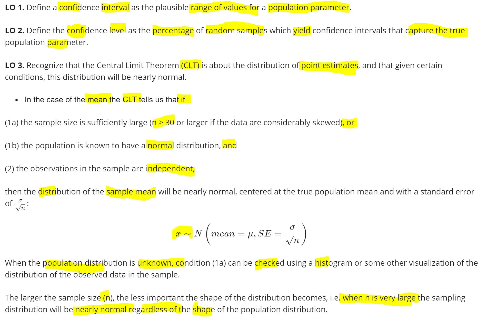
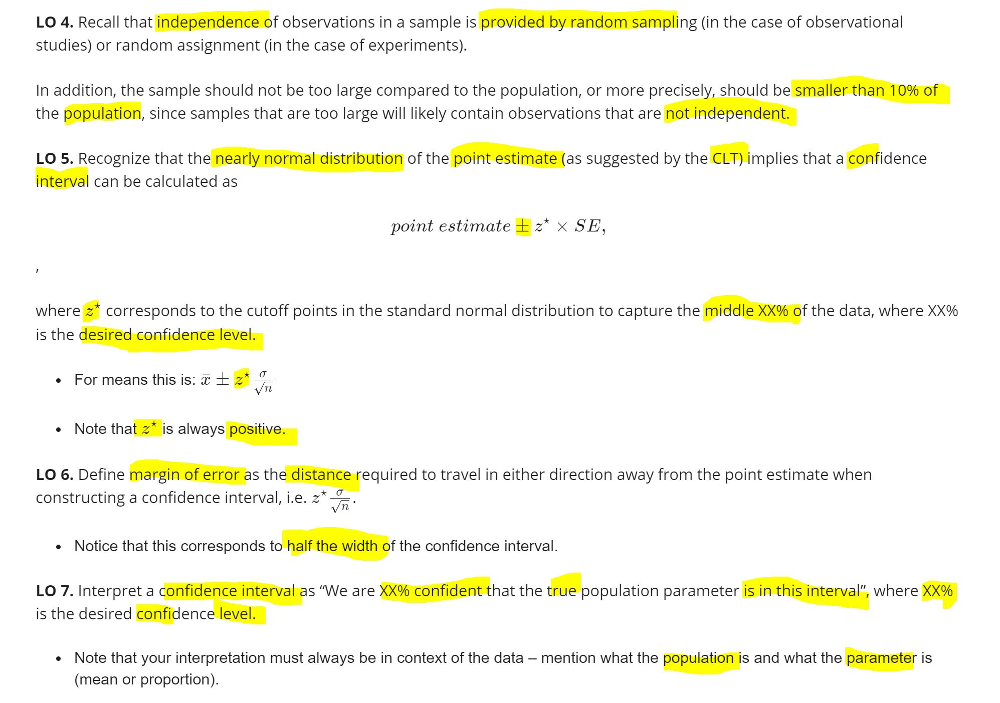
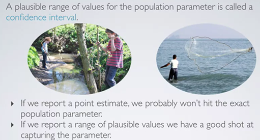
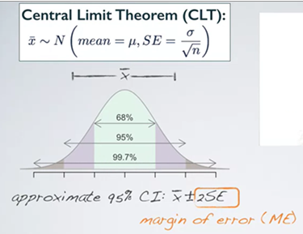
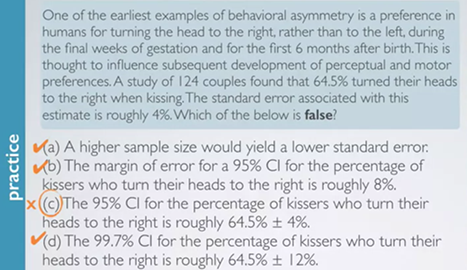
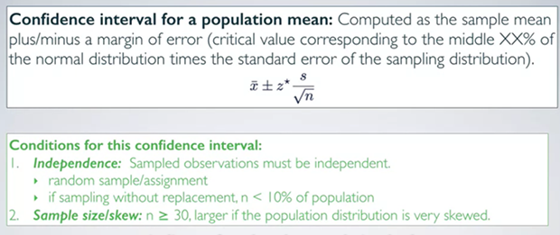
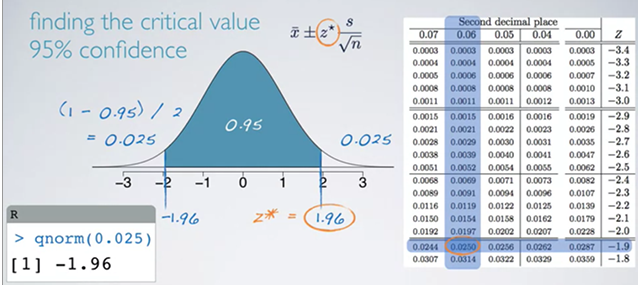
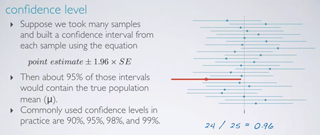
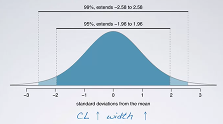
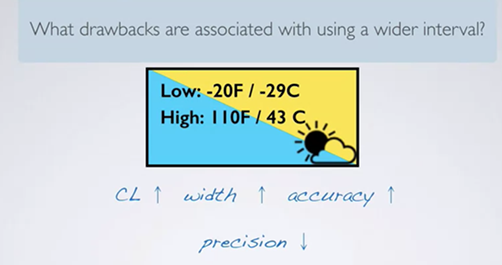

# Confidence Intervals{#conf-int}

## Chapter Summary

```{r chap2-summary-fig, echo=FALSE, fig.align='center', fig.asp=.75, fig.cap='Chapter Summary', out.width='80%'}


```

## Interval Estimate

当我们希望对一个population的parameter（如mean）做出预测的时候, 通过预测这个parameter是否在一个range之中的方式更好（而不是point estimate）

```{r fig2-1, echo=FALSE, fig.align='center', fig.asp=.75, fig.cap='Confidence interval', out.width='80%'}

```

## Margin of Error

margin of error = range一半对应的计量（若干个se）

```{r fig2-4, echo=FALSE, fig.align='center', fig.asp=.75, fig.cap='Margin of error', out.width='80%'}

```
例题1：

124情侣的研究表明，64.5%的人喜欢在接吻的时候向右歪头，se为4%

问下面说法那个错误：

```{r fig2-5, echo=FALSE, fig.align='center', fig.asp=.75, fig.cap='Example', out.width='80%'}

```

这里应该选C，因为95%CI应该是64.5%+/- 8%，因为是加减2个SE

- margin of error = 1*se: 64.5% confidential interval(CI)
- margin of error = 2*se: 95% CI
- margin of error = 3*se: 99.7% CI


## Confidential Interval

Confidential interval for a population mean:

当我们知道了sample mean的分布如何根据clt推导的时候，不需要进行多次sampling（用多组sample 来进行计算）

- 在不知道population的standard deviation `σ`时，可以直接用这一组 sample standard deviation `s` 来估`σ`,然后 用$s/sqrt(n)$ 来估计standard error(即sample mean的standard deviation)
- confidential interval: 这一组的sample mean加减 margin of error （z个se）


```{r fig2-6, echo=FALSE, fig.align='center', fig.asp=.75, fig.cap='Confidential Interval', out.width='80%'}

```

注意这里的XX% 表示的是这个distribution的middle部分的%；
比如下图中想表达95% confidence level，因此对应的是中间的95%部分

```{r fig2-7, echo=FALSE, fig.align='center', fig.asp=.75, fig.cap='Confidential Interval', out.width='80%'}

```

在判断95% confidence level的时候，往往会用X的平均值+/-两个SE

这里其实并不严谨。严格来说，应该是1.96个SE

这里1.96是通过先计算得到未被覆盖的部分占总distribution的0.025，然后用这个0.025到表中（或用左下角的R function）找到对应的值-1.96，但由于是中心对称的，所以临界值其实对应的是正负1.96.

通常将正数的对应值成为critical value，也就是1.96.

```{r qnorm}
qnorm(0.025)
qnorm(1-0.025)
```

## Confidence Level

**confidence level**

- 如果做很多次sampling（每次固定observation个数），然后取其confidence interval
- 有多少比重的sample可以contain 真正的population mean

```{r fig2-8, echo=FALSE, fig.align='center', fig.asp=.75, fig.cap='Confidential Interval', out.width='80%'}

```

**Accuracy**

- 定义： whether or not the confidence interval contains the true population parameter. 
- 例子： 这里假设取样25次，基于每次基于每个sample计算出对应的confidence interval，最后有24次都包含the true population mean(就是那个垂直的线)，这样就可以计算accuracy为24/25=0.96
- 如果我们测试足够多次数的sample，最后会得到the percentage of capturing the true population parameter 为95% 
- 常用的confidence level为90%，95%，98%，99%

**Precision**

- 定义: how small is the width of a confidence interval


- 当confidence level越大，interval就越宽

> The higher the confidence level, the larger the critical value, hence the larger the margin of error, and hence the width of the confidence interval.

```{r fig2-9, echo=FALSE, fig.align='center', fig.asp=.75, fig.cap='Confidential level', out.width='80%'}

```


- Interval 越宽，precision 越小

用一个比较wider interval的缺点是，不够precise，不够informative，就像这个例子中，如果告诉你明天的温度是-29到43°之间，accuracy一定很高，但是意义不大；

```{r fig2-10, echo=FALSE, fig.align='center', fig.asp=.75, fig.cap='Precision', out.width='80%'}

```


如何 同时增加precision（缩小range） 和 accuracy ： **增加sample size**

因为sample size变大，standard error变小，从而保证interval的width不会太宽，precision就不会因为accuracy上升而下降太多


