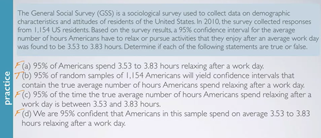
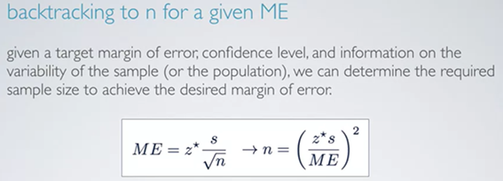
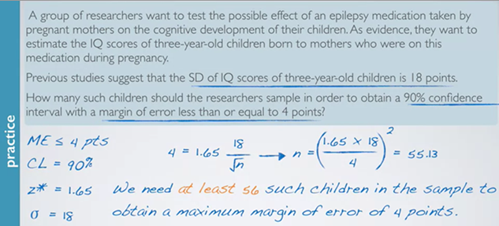
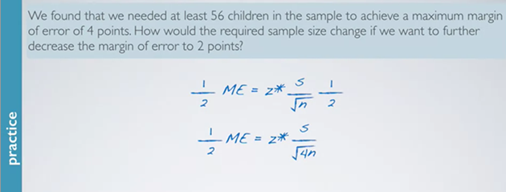
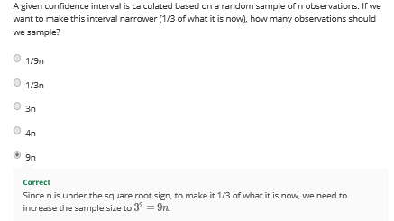
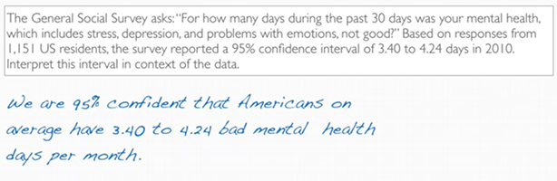
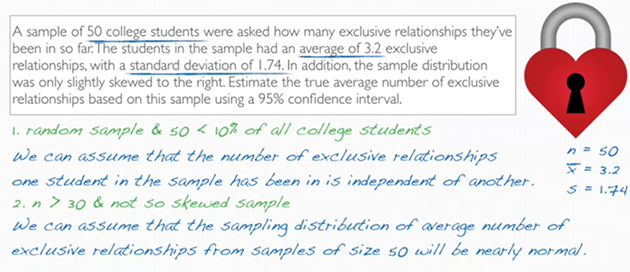
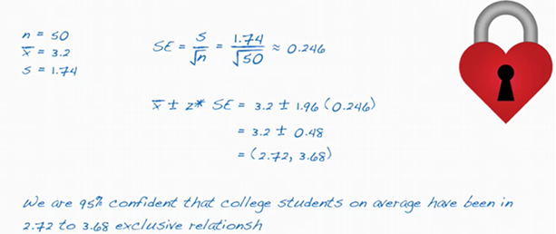
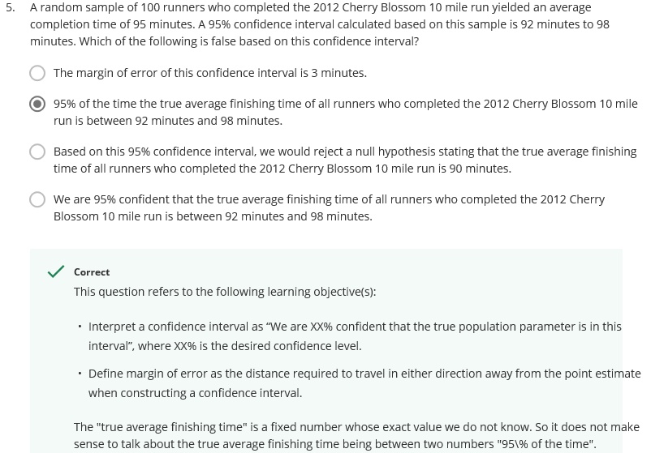

# Confidence Intervals{#conf-int}

## Chapter Summary

```{r chap2-summary-fig, echo=FALSE, fig.align='center', fig.asp=.75, fig.cap='Chapter Summary', out.width='80%'}
knitr::include_graphics('graphs/2-1.JPG')
knitr::include_graphics('graphs/2-2.JPG')
```

## Interval Estimate

当我们希望对一个population的parameter（如mean）做出预测的时候, 通过预测这个parameter是否在一个range之中的方式更好（而不是point estimate）

```{r fig2-1, echo=FALSE, fig.align='center', fig.asp=.75, fig.cap='Confidence interval', out.width='80%'}
knitr::include_graphics('graphs/2-3.png')
```

## Margin of Error

margin of error = range一半对应的计量（若干个se）

```{r fig2-4, echo=FALSE, fig.align='center', fig.asp=.75, fig.cap='Margin of error', out.width='80%'}
knitr::include_graphics('graphs/2-4.png')
```
例题1：

124情侣的研究表明，64.5%的人喜欢在接吻的时候向右歪头，se为4%

问下面说法那个错误：

```{r fig2-5, echo=FALSE, fig.align='center', fig.asp=.75, fig.cap='Example', out.width='80%'}
knitr::include_graphics('graphs/2-5.png')
```

这里应该选C，因为95%CI应该是64.5%+/- 8%，因为是加减2个SE

- margin of error = 1*se: 64.5% confidential interval(CI)
- margin of error = 2*se: 95% CI
- margin of error = 3*se: 99.7% CI


## Confidential Interval

Confidential interval for a population mean:

当我们知道了sample mean的分布如何根据clt推导的时候，不需要进行多次sampling（用多组sample 来进行计算）

- 在不知道population的standard deviation `σ`时，可以直接用这一组 sample standard deviation `s` 来估`σ`,然后 用$s/sqrt(n)$ 来估计standard error(即sample mean的standard deviation)
- confidential interval: 这一组的sample mean加减 margin of error （z个se）


```{r fig2-6, echo=FALSE, fig.align='center', fig.asp=.75, fig.cap='Confidential Interval', out.width='80%'}
knitr::include_graphics('graphs/2-6.png')
```

注意这里的XX% 表示的是这个distribution的middle部分的%；
比如下图中想表达95% confidence level，因此对应的是中间的95%部分

```{r fig2-7, echo=FALSE, fig.align='center', fig.asp=.75, fig.cap='Confidential Interval', out.width='80%'}
knitr::include_graphics('graphs/2-7.png')
```

在判断95% confidence level的时候，往往会用X的平均值+/-两个SE

这里其实并不严谨。严格来说，应该是1.96个SE

这里1.96是通过先计算得到未被覆盖的部分占总distribution的0.025，然后用这个0.025到表中（或用左下角的R function）找到对应的值-1.96，但由于是中心对称的，所以临界值其实对应的是正负1.96.

通常将正数的对应值成为critical value，也就是1.96.

```{r qnorm}
qnorm(0.025)
qnorm(1-0.025)
```

## Confidence Level

**confidence level**

- 如果做很多次sampling（每次固定observation个数），然后取其confidence interval
- 有多少比重的sample可以contain 真正的population mean

```{r fig2-8, echo=FALSE, fig.align='center', fig.asp=.75, fig.cap='Confidential Interval', out.width='80%'}
knitr::include_graphics('graphs/2-8.png')
```

**Accuracy**

- 定义： whether or not the confidence interval contains the true population parameter. 
- 例子： 这里假设取样25次，基于每次基于每个sample计算出对应的confidence interval，最后有24次都包含the true population mean(就是那个垂直的线)，这样就可以计算accuracy为24/25=0.96
- 如果我们测试足够多次数的sample，最后会得到the percentage of capturing the true population parameter 为95% 
- 常用的confidence level为90%，95%，98%，99%

**Precision**

- 定义: how small is the width of a confidence interval


- 当confidence level越大，interval就越宽

> The higher the confidence level, the larger the critical value, hence the larger the margin of error, and hence the width of the confidence interval.

```{r fig2-9, echo=FALSE, fig.align='center', fig.asp=.75, fig.cap='Confidential level', out.width='80%'}
knitr::include_graphics('graphs/2-9.png')
```


- Interval 越宽，precision 越小

用一个比较wider interval的缺点是，不够precise，不够informative，就像这个例子中，如果告诉你明天的温度是-29到43°之间，accuracy一定很高，但是意义不大；

```{r fig2-10, echo=FALSE, fig.align='center', fig.asp=.75, fig.cap='Precision', out.width='80%'}
knitr::include_graphics('graphs/2-10.png')
```


- 如何 同时增加precision（缩小range） 和 accuracy ： **增加sample size**

因为sample size变大，standard error变小，从而保证interval的width不会太宽，precision就不会因为accuracy上升而下降太多


- 例题：

针对1154 美国居民调查，95% confidence interval for the average 娱乐时间是3.53-3.73小时

```{r fig2-11, echo=FALSE, fig.align='center', fig.asp=.75, fig.cap='Example 2', out.width='80%'}

```

- A 不对是因为没有提到是基于sample中的结果，confidence interval并不是关于population中的individual的，而是关于the true population parameter (如population mean)的
- B就很好，解释了有95%的Confidence interval认为包含true population mean
- C错是在于，true population parameter是一个定值，不是一个会一会在interval一会不在interval的moving target
- D(最容易选错)错在，confidence interval不是关于sample mean的，而是关于population mean；除此之外，这个选项说有95%的confidence认为sample mean在3.53到3.83之间，但其实应该是100%，因为条件中表明了confidence level是这两个数，表明这两个数是sample mean的distribution的一部分，即这两个数一定是在这个区间内的。因此错


## Required sample size for margin of error

据以下条件，我们可以算得desired margin of error 所需要的sample size:

- target margin of error
- confidence level
- variability of the sample/population

其他条件不变的情况下，sample size越大，margin of error越小

```{r fig2-12, echo=FALSE, fig.align='center', fig.asp=.75, fig.cap='A given ME', out.width='80%'}

```

## Exercises


- 例题(1)

三岁小孩的IQ的SD：18分

问: sample要多大才能obtain 90% confidence interval with a margin of error <= 4 points?

代入公式: z* 18/sqrt(n)  = 4

```{r fig2-13, echo=FALSE, fig.align='center', fig.asp=.75, fig.cap='Exercise 1', out.width='80%'}

```

答： at least 55 samples
```{r cal-ex1}
# 5%-95%
(z <-  qnorm(1-0.05))
(z*18/4)**2
```

- 例题(2)

那如果我们要将margin of error降至2分，要如何变动sample size?


ME=z*sd/sqrt(n)

当ME下降一倍，sqrt(n)增加一倍，n增加四倍

```{r fig2-14, echo=FALSE, fig.align='center', fig.asp=.75, fig.cap='Exercise 2', out.width='80%'}

```

- 类似，问：如果让interval 下降为1/3，要如何调整n？

答：interval的大小其实就是2倍的margin of error(ME), 让ME为1/3，即要求sqrt(n)增加3倍，那么n就要增加9倍

```{r fig2-15, echo=FALSE, fig.align='center', fig.asp=.75, fig.cap='Exercise 3', out.width='80%'}

```


- 例题 3

基于1151人数据，人们在过去30天中，会有95% confidence interval of 3.40-4.24天感觉不开心

问：如何解释这里的interval

（答案如下）

```{r fig2-16, echo=FALSE, fig.align='center', fig.asp=.75, fig.cap='Exercise 3', out.width='80%'}

```


- confidence interval (CI)== point estimate +- margin of error
- CI 是关于 unknown population mean的
- CI (95%), tells us how confident we are, **that this particular interval captures that mean**


- 例题4

50个sample学生显示，sample mean是3.2个亲密关系的人，SD是1.74个，这里的sample dist有点skewed to the right

问：estimate true average based on this sample using 95% CI

答： 

我们可以用CLT：

- 这里因为sample数（50）>30 且 只是slightly skewed,可以assume the sampling distribution of average number 是nearly normal
- 50学生，我们假设>10%,所以符合independent
- sample是random selected

ME = z*SD/sqrt(n)

```{r cal-ex4}
# 2.5%-97.5%
sd=1.74
n=50
z=qnorm(1-0.025)
sample_mean=3.2
(ME <- z*sd/(n**(1/2)))
print(paste("confidence interval:",sample_mean-ME,"~",sample_mean+ME))

```


```{r fig2-17, echo=FALSE, fig.align='center', fig.asp=.75, fig.cap='Exercise 4', out.width='80%'}


```

- 例题5

random sample: 100 runners, 跑完10mile的平均速度是95 min，95% CI是92min-98min，问下面哪个不对：

注意下面2中正确的说法应该是：

> CI: we are XX% confident that the true population parameter is in this interval

```{r fig2-19, echo=FALSE, fig.align='center', fig.asp=.75, fig.cap='Exercise 5', out.width='80%'}

```


