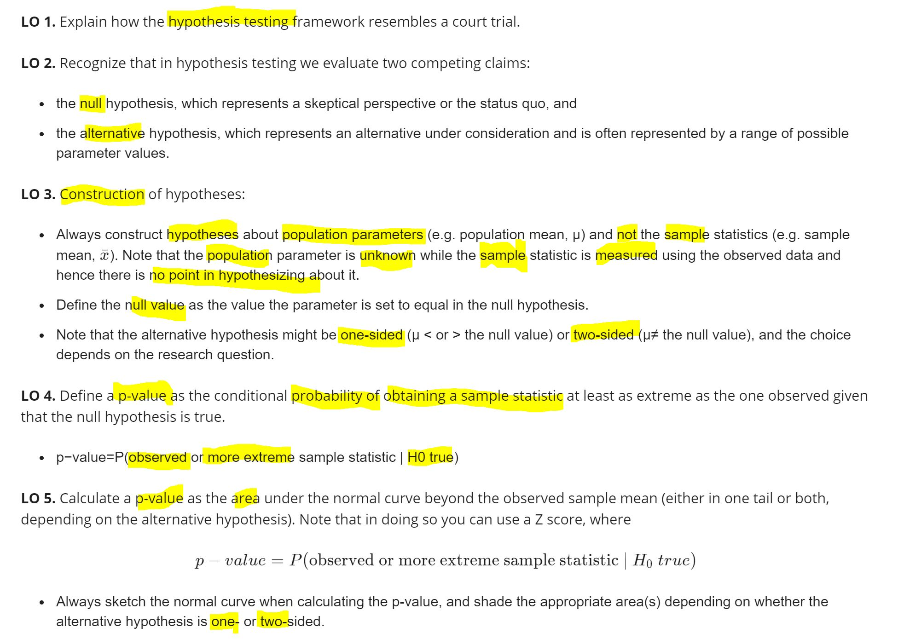

# Hypothesis Testing{#test}

## Chapter Summary

```{r chap3-summary-fig, echo=FALSE, fig.align='center', fig.asp=.75, fig.cap='Chapter Summary', out.width='80%'}

knitr::include_graphics('graphs/3-2.JPG')
```


